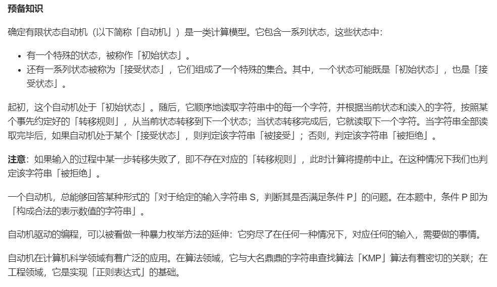

# LeetCodeJava
## 动态规划系列
### 最长上升子序列（LIS）
## [二叉树系列](notes/二叉树系列.md)
## [前缀和系列](notes/前缀和系列.md)
### 题目一：和可被 K 整除的子数组
## 快慢指针
## 双向链表系列
## 双指针系列
## 卡特兰数系列
<div align="center">
  
</div>
典型应用：
    n个结点的二叉树种类、size为n的栈出栈顺序有多少种、凸多边形分割问题
<div align="center">
  
</div>

## 拓扑排序系列

## [欧拉回路（欧拉通路系列）](notes/欧拉回路（欧拉通路系列）.md)
### [Hierholzer算法](https://leetcode-cn.com/problems/reconstruct-itinerary/solution/zhong-xin-an-pai-xing-cheng-by-leetcode-solution)
该算法用于在连通图中寻找欧拉路径，其流程如下：
  1.从起点出发，进行深度优先搜索；
  2.每次沿着某条边从某个顶点移动到另外一个顶点的时候，都需要删除这条边；
  3.如果没有可移动的路径，则将所在节点加入到栈中，并返回。


## 字符串处理
### KMP算法

getNext
```cpp
void getNext(const string& s, vector<int>& next)
{
    int ssize = s.size();
    int j = -1;

    for(int i = 1; i < ssize; i++)
    {
        j = next[i - 1];

        while(j != -1 && s[j + 1] != s[i])
        {
            j = next[j];
        }

        if(s[j + 1] == s[i])
        {
            next[i] = j + 1;
        }
    }
}
```

KMP
```cpp
int KMP(string s, string t)
{
    //s 模式串 t目标串
    int ssize = s.size(), tsize = t.size();

    vector<int> next(ssize, -1);
    getNext(s, next);

    int i = 0, j = 0;

    while(i < ssize && j < tsize)
    {
        if(j == -1 || s[i] == t[j])
        {
            i++;
            j++;
        }
        else
        {
            j = next[j];
        }
    }
    return j >= tsize ? i - tsize : -1;
}
};
```

## [有限状态自动机](notes/自动机.md)
[自动机简介](https://leetcode-cn.com/problems/biao-shi-shu-zhi-de-zi-fu-chuan-lcof/solution/biao-shi-shu-zhi-de-zi-fu-chuan-by-leetcode-soluti/)
<div align="center">
  
</div>

## [N皇后问题](notes/N皇后问题.md)
